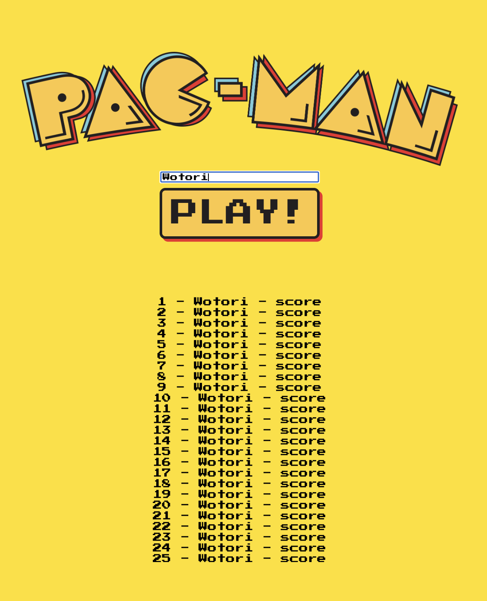
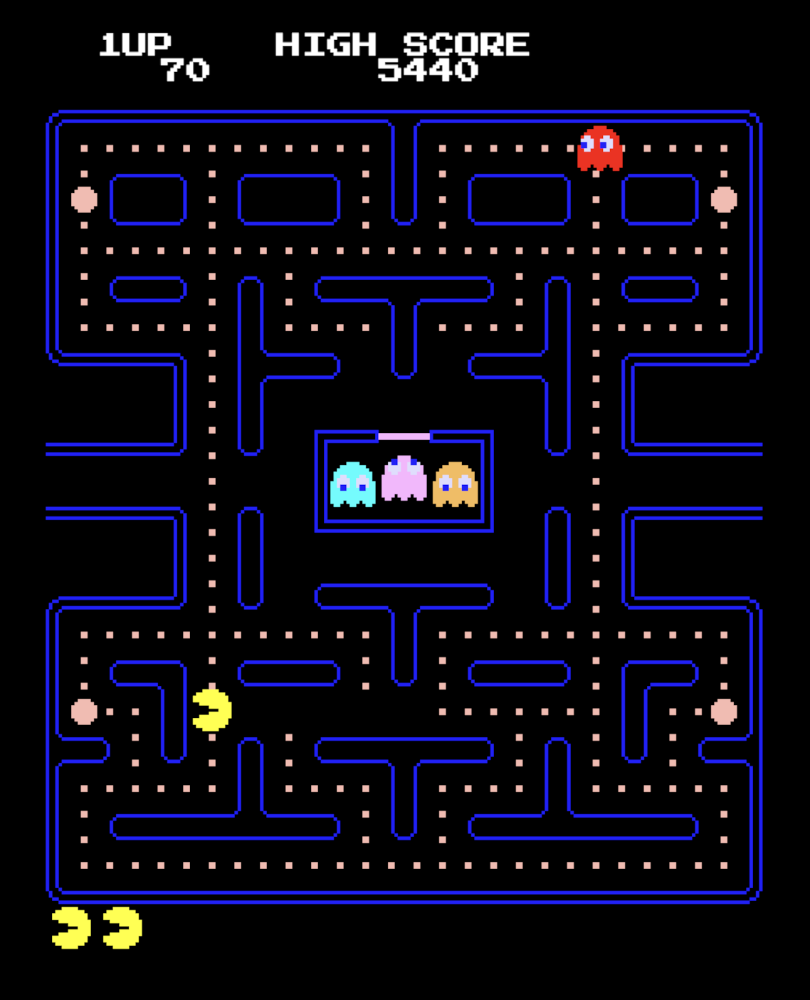

# arcade-pacman

This repository is a fork from the original [pacman-js](https://github.com/bward2/pacman-js) project. The objective of this project is to implement a scoreboard and update the source project to be compatible with the latest version of Parcel and JavaScript in general. Additionally, import/export features was implemented for smooth comilation with Parcel.
****

  
   

## Additional features

- Basic score board implementation
- Parcel compilation and development
- Further updates will be made in the near future, probably...

## Installation

1. Clone the repository
2. Navigate to the project directory using `cd arcade-pacman`
3. Install the dependencies using `yarn install`

## Usage

To start the project, run `yarn dev` and navigate to the suggested address (in terminal).

## Contributing

Contributions to the project are welcome! It would be fantastic to maintain this piece of code up-to-date with the latest technology.

## License

This project is licensed under the MIT License. See `LICENSE` for more information.
